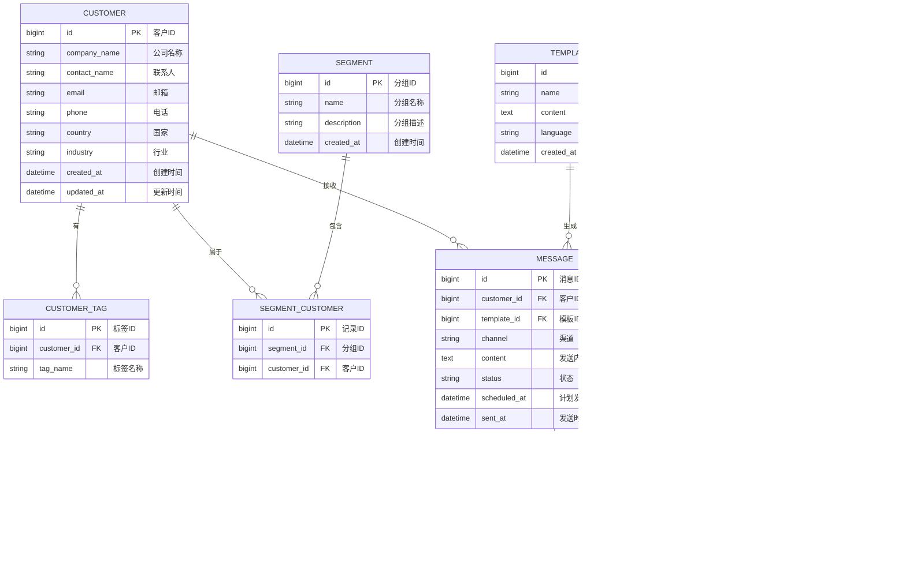

# 数据库ER图
**项目名称：** 海外自动化营销系统  
**版本号：** V1.0  
**发布日期：** 2025-08-08  
**撰写人：** 数据架构部  

---

## 1. ER 图（Mermaid）

---

## 2. 模型说明
- **CUSTOMER**：存储客户基础信息，是整个系统的核心数据实体。
- **CUSTOMER_TAG**：多标签机制支持客户画像维度化。
- **SEGMENT** / **SEGMENT_CUSTOMER**：支持客户分组与批量营销策略。
- **TEMPLATE**：存储营销内容模板，支持多语言。
- **MESSAGE**：记录每条发送任务及状态。
- **TRACK_EVENT**：记录消息的用户行为反馈。
- **USER** / **ROLE_PERMISSION**：实现 RBAC 权限控制。

---

## 3. 设计特点
- **多对多关系**：客户与标签、客户与分组均为多对多。
- **可扩展字段**：预留 JSON 字段扩展（如客户自定义属性）。
- **审计字段**：所有表均包含 `created_at`、`updated_at`。
- **外键约束**：保证数据一致性，防止孤立记录。

---