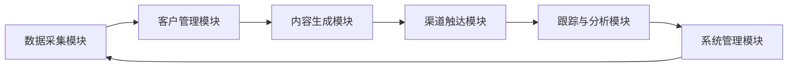
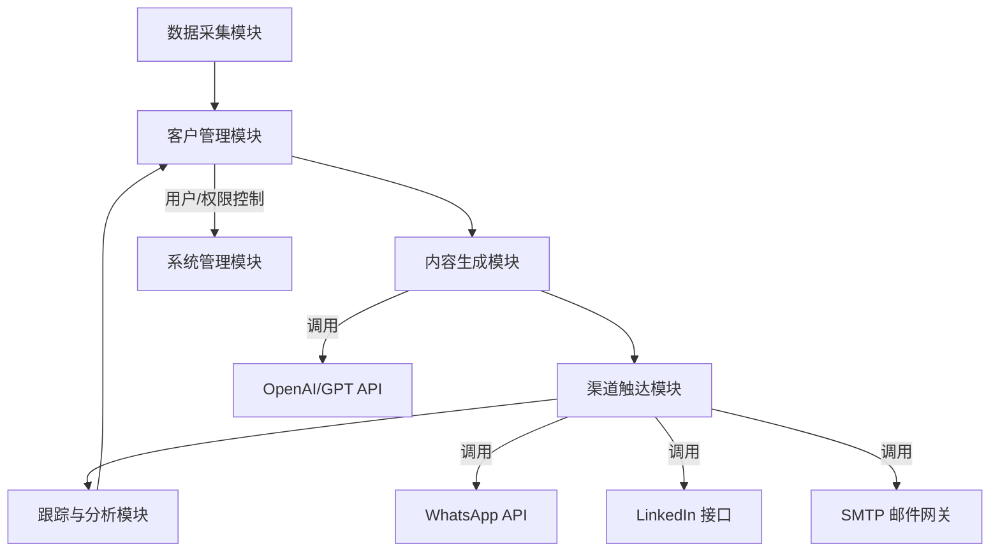

# 模块职责说明
**项目名称：** 海外自动化营销系统  
**版本号：** V1.0  
**发布日期：** 2025-08-08  
**撰写人：** 技术架构部  

---

## 1. 模块总览

本系统分为 **6 大核心模块 + 1 个系统管理模块**，各模块职责清晰，便于独立开发与部署。

---

## 2. 模块职责明细

### 2.1 数据采集模块
**主要职责**：
- 从多种渠道（Excel、CSV、API、爬虫）获取潜在客户数据
- 进行数据清洗（去重、格式化、统一编码）
- 将数据统一存储到客户信息库中

**子功能**：
1. **文件导入子模块**：Excel/CSV 文件解析与格式校验
2. **API 集成子模块**：对接海关数据、展会官网、行业名录等
3. **爬虫任务子模块**：定制化采集任务调度、结果存储
4. **数据清洗子模块**：去重规则、脏数据过滤、字段标准化

---

### 2.2 客户管理模块
**主要职责**：
- 存储和管理客户基础信息
- 构建客户画像与标签体系
- 对客户进行分组与分类管理

**子功能**：
1. **客户信息库**：支持结构化存储，字段可扩展
2. **标签管理**：支持多维度标签（兴趣、行业、规模、采购角色）
3. **去重合并**：基于模糊匹配算法识别重复客户
4. **分组管理**：自定义条件筛选并批量分组

---

### 2.3 内容生成模块
**主要职责**：
- 提供可编辑的开发信模板库
- 结合客户画像与产品信息生成个性化内容
- 支持多语言翻译与优化

**子功能**：
1. **模板库管理**：行业通用模板、变量占位符
2. **AI 文案生成**：调用 GPT API 基于画像生成开发信
3. **多语言支持**：集成翻译引擎，生成多语种版本
4. **版本管理**：保存不同内容版本，用于 AB 测试与复盘

---

### 2.4 渠道触达模块
**主要职责**：
- 将生成的内容发送到目标客户
- 支持多渠道发送策略与排程

**子功能**：
1. **邮件发送**：SMTP 配置、批量群发、跟踪
2. **WhatsApp 推送**：调用 WhatsApp Business API
3. **LinkedIn 消息**：插件或半自动脚本发送
4. **发送排程**：设置时间、频率、优先级
5. **频控与退订**：避免触发封号或垃圾邮件标记

---

### 2.5 跟踪与分析模块
**主要职责**：
- 记录客户与内容的交互行为
- 生成可视化报表和分析结果

**子功能**：
1. **行为跟踪**：打开、点击、回复埋点
2. **意向客户标记**：自动或手动加入意向池
3. **报表统计**：打开率、点击率、回复率、ROI
4. **AB 测试**：不同标题/内容效果对比分析

---

### 2.6 系统管理模块
**主要职责**：
- 系统用户与权限管理
- 日志审计与数据备份
- 通知与告警管理

**子功能**：
1. **用户与权限**：多角色、RBAC 权限控制
2. **通知中心**：异常、任务、线索提醒
3. **日志审计**：记录用户操作与系统事件
4. **数据备份**：定期备份，支持恢复

---

## 3. 模块依赖关系（逻辑）

---

## 4. 模块非功能要求
- **高可用性**：核心模块需支持集群部署，保证服务连续性
- **可扩展性**：模块接口遵循 RESTful 标准，便于新增渠道与数据源
- **安全性**：模块间通信需加密（HTTPS/gRPC TLS），重要数据加密存储
- **可维护性**：模块代码与文档分离，版本控制清晰

---

## 5. 模块迭代优先级（V1.0 阶段）
1. **必需模块**：数据采集、客户管理、内容生成、渠道触达
2. **增强模块**：跟踪与分析
3. **管理模块**：系统管理

---