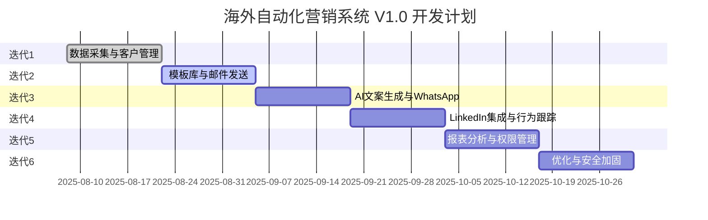

# 甘特图与迭代计划
**项目名称：** 海外自动化营销系统  
**版本号：** V1.0  
**发布日期：** 2025-08-08  
**撰写人：** 项目管理组  

---

## 1. 迭代规划
- **迭代周期**：每次迭代 2 周
- **总周期**：V1.0 计划 12 周交付
- **阶段划分**：
  1. **迭代1（第1-2周）**：数据采集、客户管理基础
  2. **迭代2（第3-4周）**：模板库、邮件发送
  3. **迭代3（第5-6周）**：AI 文案生成、WhatsApp 集成
  4. **迭代4（第7-8周）**：LinkedIn 集成、行为跟踪
  5. **迭代5（第9-10周）**：报表分析、权限管理
  6. **迭代6（第11-12周）**：优化、性能测试、安全加固

---

## 2. 甘特图（Mermaid）

---

## 3. 验收与里程碑
- 每个迭代结束需完成：
  - 功能开发
  - 单元测试与集成测试
  - 代码审查
  - 部署到测试环境
- 里程碑：
  - **M1**：完成基础数据流
  - **M2**：多渠道触达可用
  - **M3**：全链路闭环运行

---

## 4. 版本记录
- **V1.0**：首次定义迭代甘特图与阶段计划

---