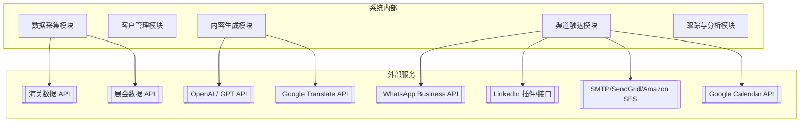
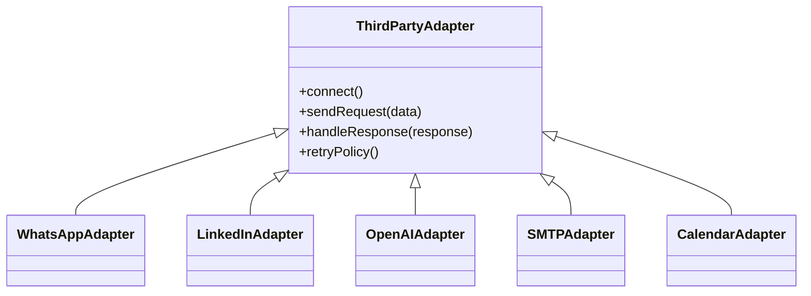

# 第三方服务集成
**项目名称：** 海外自动化营销系统  
**版本号：** V1.0  
**发布日期：** 2025-08-08  
**撰写人：** 技术架构部  

---

## 1. 集成目标
本系统需与多类第三方平台和 API 集成，以实现数据采集、内容生成、多渠道触达、日程管理等功能，形成完整的自动化营销闭环。  
第三方服务需在系统中以**模块化适配器**方式实现，保证灵活替换与版本升级。

---

## 2. 集成架构概览

---

## 3. 第三方服务清单与集成说明

### 3.1 数据采集类
| 服务名称     | 用途               | 集成方式 | 认证方式            | 注意事项             |
| ------------ | ------------------ | -------- | ------------------- | -------------------- |
| 海关数据 API | 获取进出口企业信息 | REST API | API Key             | 需购买数据服务或订阅 |
| 展会数据 API | 获取参展企业名单   | REST API | API Key / OAuth 2.0 | 需展会主办方授权     |

---

### 3.2 内容生成与多语言支持类
| 服务名称             | 用途               | 集成方式 | 认证方式 | 注意事项                   |
| -------------------- | ------------------ | -------- | -------- | -------------------------- |
| OpenAI / GPT API     | 个性化开发信生成   | REST API | API Key  | 控制请求速率，防止超额计费 |
| Google Translate API | 自动翻译多语言版本 | REST API | API Key  | 翻译质量需人工校对         |

---

### 3.3 渠道触达类
| 服务名称                               | 用途                   | 集成方式        | 认证方式                    | 注意事项                       |
| -------------------------------------- | ---------------------- | --------------- | --------------------------- | ------------------------------ |
| WhatsApp Business API                  | 发送模板消息、跟进对话 | REST API        | OAuth 2.0 / Facebook App ID | 需审核模板，遵守 24h 会话规则  |
| LinkedIn 插件/接口                     | 发送 InMail 或连接请求 | 插件 / REST API | OAuth 2.0                   | 建议半自动化以降低封号风险     |
| SMTP 邮件网关（SendGrid / Amazon SES） | 批量邮件发送           | SMTP / REST API | API Key / SMTP 用户名密码   | 配置 SPF/DKIM/DMARC 提高送达率 |
| Google Calendar API                    | 同步销售日程与跟进任务 | REST API        | OAuth 2.0                   | 用户需授权访问其日历           |

---

## 4. 集成模式与适配策略

### 4.1 统一接口适配器模式
所有第三方 API 都通过内部 **Adapter 类** 进行封装，调用方只需依赖统一接口，屏蔽底层实现差异。  

优点：
- 易于切换供应商
- 错误处理与重试策略统一
- 日志与监控接入点统一

---

### 4.2 API 限流与容错机制
- **限流**：基于令牌桶算法实现请求频率控制
- **重试**：指数退避策略（最大 3 次）
- **熔断**：连续失败时自动暂停调用并告警
- **降级**：当 API 不可用时使用备用通道（如邮件发送改走备用 SMTP）

---

### 4.3 安全与合规
- **加密传输**：HTTPS / TLS 1.2+
- **认证存储**：API Key / OAuth Token 存储于安全密钥管理服务（如 Vault、AWS KMS）
- **日志脱敏**：在日志中屏蔽敏感信息（邮箱、电话、Token）
- **合规要求**：
  - 符合 GDPR 对跨境数据传输的要求
  - 邮件与 WhatsApp 消息必须包含退订/取消选项
  - LinkedIn 消息遵循平台用户协议

---

## 5. 测试与监控
- **测试**：集成环境使用测试 API Key，模拟全链路调用
- **监控**：
  - API 调用成功率
  - 平均响应时间
  - 错误类型分布
- **告警**：当失败率超过设定阈值时触发即时通知（邮件/Slack/钉钉）

---

## 6. 后续优化方向
- 接入 **统一 API 网关**（如 Kong / APISIX）集中管理路由、认证、限流
- 增加 **本地缓存层** 减少重复请求（特别是翻译结果）
- 对接更多行业数据源（Yellow Pages API、B2B 平台数据接口）
- 引入 AI 内容优化 API（如 Grammarly API）提高文案质量

---