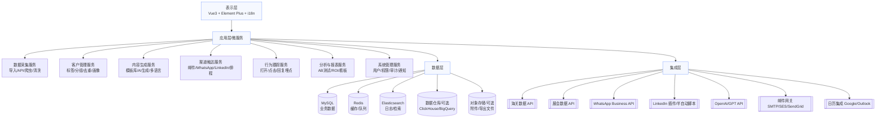
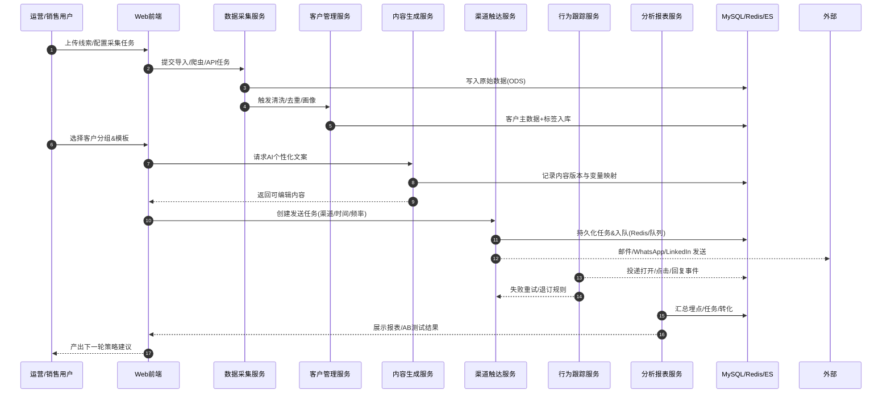
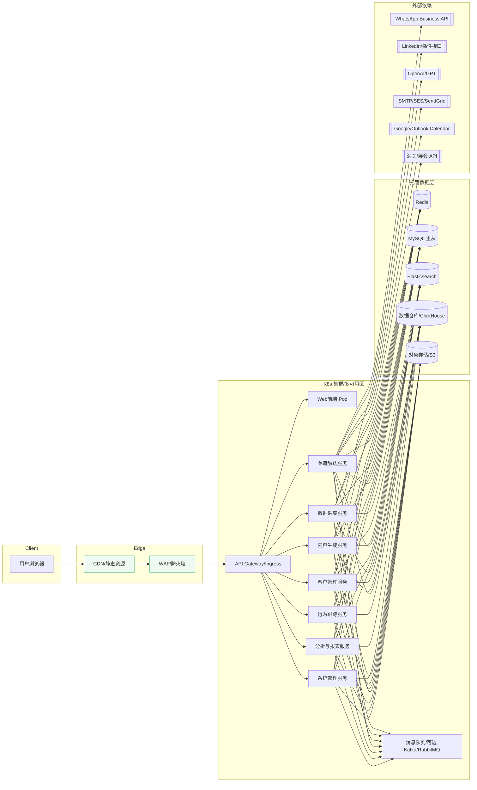

# 系统架构图说明
**项目名称：** 海外自动化营销系统  
**版本号：** V1.0  
**发布日期：** 2025-08-08  
**撰写人：** 技术架构部  

> 说明：本文使用 Mermaid 绘制架构图。若在本地无法渲染，请在支持 Mermaid 的 Markdown 工具中打开（如 VSCode + Markdown Preview Mermaid、Typora、Obsidian、GitLab/GitHub 部分场景等）。

---

## 1. 总体架构（分层视图）

**解读要点**
- **表示层**：统一的运营与管理界面。
- **应用层**：按领域拆分服务，天然支持横向扩展。
- **数据层**：冷热分离，缓存/检索/仓库分工明确。
- **集成层**：第三方服务与外部系统统一由集成层治理。

---

## 2. 服务交互与数据流（关键业务链路）

**解读要点**
- 事件埋点由 **行为跟踪服务** 统一采集，避免各服务各自为政。
- **内容生成服务** 记录“版本-变量映射”，便于 AB 与复盘。
- **渠道触达服务** 统一排程/重试/频控/退订治理，降低封号与拒收风险。

---

## 3. 部署拓扑（生产环境建议）

**解读要点**
- **WAF + Ingress**：统一入口与安全策略。
- **消息队列**：削峰填谷、异步解耦（大批量发送/重试尤为关键）。
- **数据主从/多AZ**：提升可用性与读性能。
- **对象存储**：用于模板附件、导出文件、日志归档等。

---

## 4. 核心非功能设计要点
- **可观测性**：应用日志（结构化 JSON）→ ES；指标 → Prometheus/Grafana；链路追踪 → OpenTelemetry。
- **弹性与限流**：发送任务按渠道频控，Tenant/账号级 QPS 限制，灰度发布。
- **容错与重试**：幂等键（任务ID+收件人+渠道），指数退避重试；失败原因分类（硬退信/软退信/封禁/网络）。
- **数据合规**：GDPR/CCPA，数据遮蔽与可删除请求（Right to be forgotten），退订/黑名单全局治理。
- **多租户**（可选）：Tenant 隔离（逻辑库/表前缀/行级安全），配置与配额独立。

---

## 5. 渠道治理策略（摘要）
- **邮件**：SPF/DKIM/DMARC 配置；冷热 IP；退订/垃圾标记收敛；分层白名单。
- **WhatsApp**：模板消息审批；24h 会话窗口合规；号码信誉分级；发送速率分档。
- **LinkedIn**：半自动/人工辅助（避免批量自动化触发风控）；节奏与话术多样化。

---

## 6. 图例（Legend）
- **矩形**：服务/组件  
- **圆角矩形**：逻辑分层/分组  
- **双圆**：持久化存储  
- **虚线箭头**：外部依赖/第三方

---